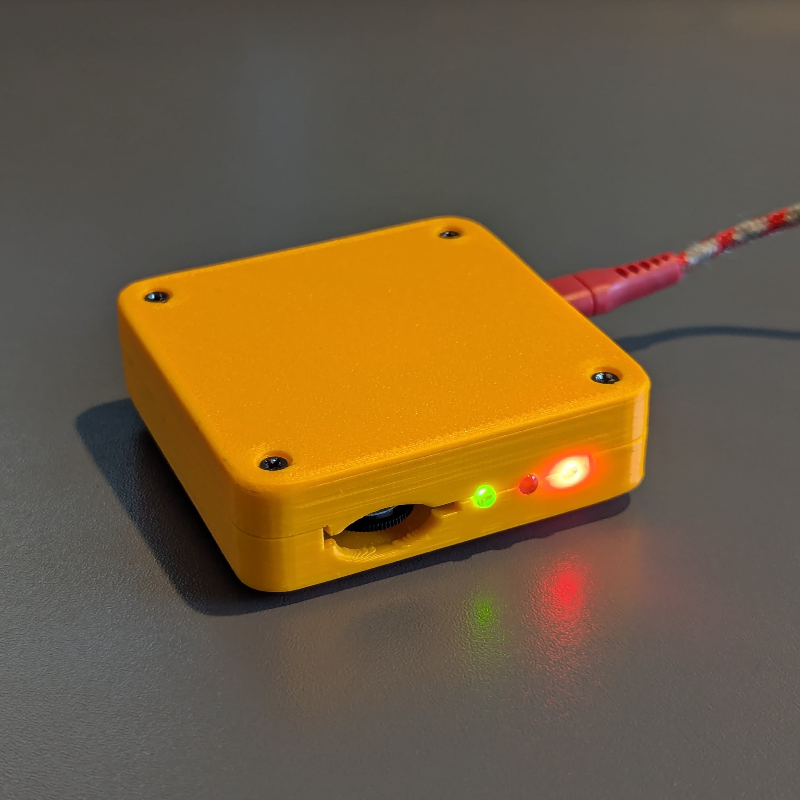
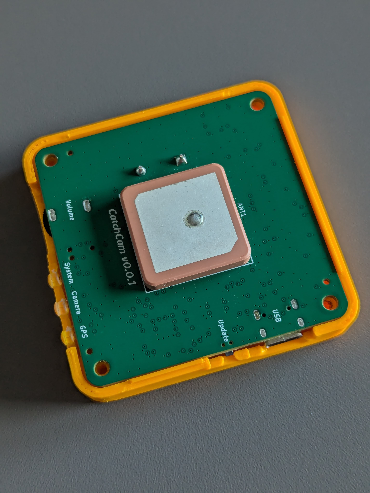

# Catchcam

<div style="display: flex;">
  
  
</div>

## About

Catchcam is a plug and play speed camera detector that works completely offline. It's similar to Waze or Radarbot, but with total privacy in mind - nobody tracks where you are, and no internet connection is needed. Just plug it into USB socket and drive.

It features:

- Built-in speaker and LED for alerts,
- Already packed with 66,000+ known speed camera positions, with more coming soon,
- Easy updates - just plug into your PC and drag-and-drop the latest software.

You can view the project progress on my blog [here](https://ivanvnucec.github.io/tags/#catchcam)

If you're interested, you can pre-order a sample by sending an email to [vnucec.ivan@gmail.com](mailto:vnucec.ivan@gmail.com).

### How it works

Catchcam uses a GPS module to determine your speed and position. It then compares your position to a database of known speed camera locations. If you're approaching a speed camera, Catchcam will alert you with a voice message spefiying the camera speed limit and a visual LED alert.

Speed camera database is updated regularly from the [OpenStreetMap](https://www.openstreetmap.org/).

## How to update the device

To update the device, first you need to download the latest software from the [releases](https://github.com/IvanVnucec/catchcam/releases) page.

Then, press and hold the button on the device while plugging it into your PC. The device will show up as a USB drive, and you can drag-and-drop the new software onto it. After the update is complete, the device will restart and you're good to go.

## Development

### Prerequisites

- CMake 3.13+
- Raspberry Pi Pico SDK (version 2.0.0)

### Setup

Clone the repository and initialize submodules:

```sh
git submodule update --init
```

### Build

```sh
# Configure the project
cmake -B build -S .

# Build the project
cmake --build build
```
